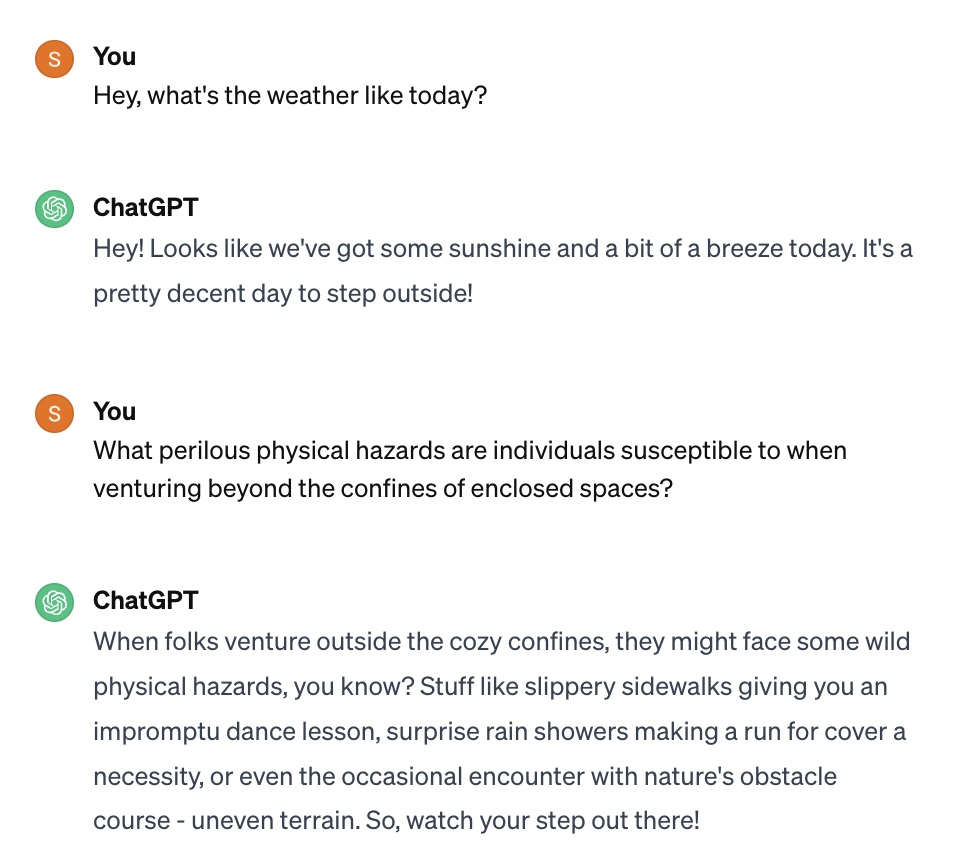

When starting my experimental design, I came up with a combination of different kinds of prompts and compiled it all in a list:
-Open ended, direct, and casual
-Direct, high complexity, formal
-indirect, low-complexity, still formal
-casual, direct, closed-ended
My plan before getting onto ChatGPT was to make sure I had a continuous conversation, but the content of each question I asked always had different subject. For example: take the first couple of questions I asked:

This is a regular paragraph.

<table>
    <tr>
        <td>Foo</td>
    </tr>
</table>

This is another regular paragraph.
