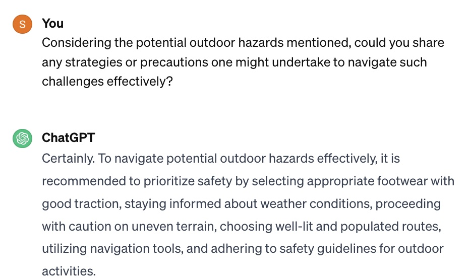
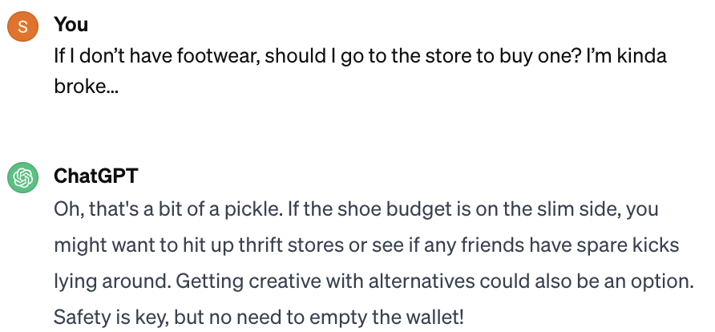

When starting my experimental design, I came up with a combination of different kinds of prompts and compiled it all in a list:   
*   Open ended, direct, and casual  
*   Direct, high complexity, formal  
*   Indirect, low-complexity, formal  
*   Casual, direct, closed-ended  

My plan before getting onto ChatGPT was to make sure I had a continuous conversation, but the content of each question I asked always had different subject. For example: take the first couple of questions I asked:  

As you can see, the first question was direct and very casual (as indicated by the ‘Hey’ at the start); it allowed ChatGPT freedom to answer but it was to-the-point. Then, I started to turn the conversation to something a bit more serious, also direct but now high complexity. I thought this was interesting because ChatGPT was still talking to me in a more casual tone tone! So I continued with the formal tone in hopes that ChatGPT would adjust:     

So yes, ChatGPT’s response did adjust. Not only did they give me a formal response again, but also they gave me a direct response as well. So, to change it up, I asked a simple yes or no question to throw ChatGPT off:   

